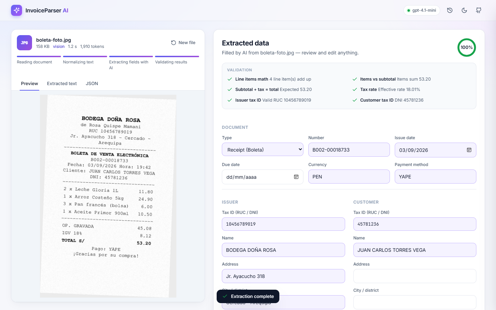
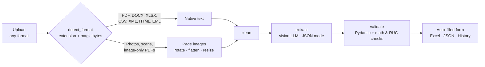
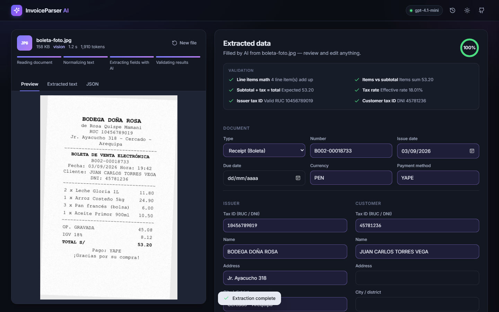

<div align="center">

# InvoiceParser AI

**Drop an invoice, receipt or ticket in (almost) any format and watch an AI fill the form for you.**

PDF · scanned PDF · photos · Word · Excel · CSV · e-invoice XML · JSON · HTML · e-mails

[](https://github.com/LeonAchata/InvoiceParser-AI/actions/workflows/ci.yml)




</div>

---

## What it does

1. **You drop a file** — drag & drop, file picker, or just paste a screenshot with <kbd>Ctrl</kbd>+<kbd>V</kbd>.
2. **The pipeline reads it** — native text when the file has it (PDF, DOCX, XLSX, XML…), page images for photos and scanned PDFs.
3. **A vision LLM extracts the fields** into a strict schema: document type & number, dates, issuer, customer, line items, subtotal, tax, total, withholding (*detracción*), currency and payment method.
4. **Deterministic checks validate the math** — line totals, items vs subtotal, subtotal + tax = total, tax rate, withholding, **RUC check digit**, date formats — and flag the fields that need a human look.
5. **The form fills itself**, field by field. Edit anything, then export to **Excel** or **JSON**, copy it, or save it to the built-in **history**.

It was built with Peruvian documents in mind (*facturas*, *boletas*, RUC/DNI, IGV, SUNAT UBL XML), but works with invoices in any language and currency.

## Features

| | |
|---|---|
| 📄 **17 input formats** | PDF, scanned PDF, JPG, PNG, WEBP, GIF, BMP, TIFF (multi-page), HEIC (iPhone photos), DOCX, XLSX, CSV/TSV, XML (UBL e-invoices), JSON, HTML, TXT/MD and `.eml` e-mails **with their attachments** |
| **Automatic OCR-free vision** | Scanned PDFs and photos are rendered, auto-rotated (EXIF), downscaled and sent to a vision model — no Tesseract needed |
| **LangGraph pipeline** | `load → clean → extract → validate`, with per-step timings streamed to the UI as live progress |
| **Validation layer** | Math, tax-rate, withholding and RUC checksum checks + a completeness score, so you know what to trust |
| **Modern UI, zero build** | Vanilla JS/CSS: drag & drop, paste, document preview, animated autofill, editable line items, recalculation, dark mode, responsive |
| **History & export** | SQLite history (no DB server needed), styled Excel export, JSON download / copy |
| **Any OpenAI-compatible model** | OpenAI, Azure OpenAI, OpenRouter, Ollama… via `OPENAI_BASE_URL` |
| **Tested** | 30+ tests over real sample files, API and LLM request shape (mocked, no key needed) + CI on Python 3.11–3.13 |

## Quick start

> Requirements: Python 3.11+ and an OpenAI API key (or any OpenAI-compatible endpoint with a vision model).

```bash
git clone https://github.com/LeonAchata/InvoiceParser-AI.git
cd InvoiceParser-AI

python -m venv .venv
source .venv/bin/activate          # Windows: .venv\Scripts\activate
pip install -r requirements.txt

cp .env.example .env               # then set OPENAI_API_KEY
uvicorn app.main:app --reload
```

Open **http://localhost:8000** and click one of the sample documents — or drop your own.
Interactive API docs live at **http://localhost:8000/api/docs**.

### With Docker

```bash
cp .env.example .env               # set OPENAI_API_KEY
docker compose up --build
```

History is persisted in the `invoice-data` volume.

## Try it with the samples

The [`samples/`](samples) folder contains **fictitious** documents covering every loader (regenerate them with `python scripts/generate_samples.py`):

| File | What it exercises |
|---|---|
| `factura-electronica.pdf` | Digital PDF with native text, IGV and *detracción* |
| `factura-escaneada.pdf` | Image-only PDF → vision path |
| `boleta-foto.jpg` | Tilted, noisy photo of a *boleta* → vision path |
| `invoice-northwind.docx` | English invoice with a table, discount and US sales tax |
| `factura-mar-azul.xlsx` | Invoice laid out in a spreadsheet, USD |
| `factura-ubl-sunat.xml` | SUNAT UBL 2.1 e-invoice (signature stripped before prompting) |
| `email-con-factura.eml` | E-mail whose PDF attachment is extracted recursively |

## How it works



- **Loaders** ([`app/loaders/`](app/loaders)) turn any file into a `LoadedDocument` holding text, images or both. A PDF is treated as scanned when its pages have too little extractable text; a DOCX with no text sends its embedded pictures; an `.eml` recursively loads its attachments.
- **Pipeline** ([`app/pipeline/graph.py`](app/pipeline/graph.py)) is a LangGraph `StateGraph`. `astream` updates are forwarded to the job so the UI stepper shows the real current step.
- **Schema** ([`app/schemas.py`](app/schemas.py)) normalizes what models tend to return: `"S/ 1,500.00"` → `1500.0`, `"1.500,50"` → `1500.5`, `factura` → `INVOICE`, `S/` → `PEN`, `contado` → `CASH`…
- **Validation** ([`app/pipeline/validation.py`](app/pipeline/validation.py)) is plain, deterministic Python — the LLM extracts, code verifies.

## API

| Method | Endpoint | Description |
|---|---|---|
| `POST` | `/api/extract` | Upload a file (`multipart/form-data`, field `file`). Returns a job. Add `?wait=true` to get the result in the same call |
| `GET` | `/api/jobs/{id}` | Job status: `queued` · `processing` (with current `step`) · `completed` (with `result`) · `failed` (with `error`) |
| `GET` | `/api/formats` | Supported extensions and size limit |
| `POST` | `/api/export/xlsx` | `{data, filename}` → styled Excel file |
| `GET` `POST` | `/api/documents` | List / save documents in the history |
| `GET` `DELETE` | `/api/documents/{id}` | Get / delete a saved document |
| `GET` | `/api/health` | Status, model and active jobs |

```bash
curl -F "file=@samples/boleta-foto.jpg" "http://localhost:8000/api/extract?wait=true"
```

<details>
<summary>Example response (trimmed)</summary>

```json
{
  "id": "4f0c…",
  "status": "completed",
  "result": {
    "data": {
      "document_type": "RECEIPT",
      "document_number": "B002-00018733",
      "issue_date": "2026-09-03",
      "currency": "PEN",
      "payment_method": "YAPE",
      "issuer":   { "tax_id": "10456789019", "name": "BODEGA DOÑA ROSA", "address": "Jr. Ayacucho 318", "city": "Cercado - Arequipa" },
      "customer": { "tax_id": "45781236", "name": "JUAN CARLOS TORRES VEGA", "address": null, "city": null },
      "items": [
        { "description": "Leche Gloria 1L", "quantity": 2, "unit_price": 5.9, "amount": 11.8 }
      ],
      "subtotal": 45.08, "tax": 8.12, "tax_rate": 18, "total": 53.2, "withholding": null
    },
    "checks": [
      { "id": "total_math", "label": "Subtotal + tax = total", "status": "pass", "detail": "Expected 53.20", "field": "total" },
      { "id": "issuer_ruc", "label": "Issuer tax ID", "status": "pass", "detail": "Valid RUC 10456789019", "field": "issuer.tax_id" }
    ],
    "completeness": 1.0,
    "document": { "format": "jpeg", "method": "vision", "pages": 1, "images_sent": 1 },
    "usage": { "prompt": 1530, "completion": 380, "total": 1910, "model": "gpt-4.1-mini" },
    "timings": { "load": 0.04, "clean": 0.0, "extract": 3.1, "validate": 0.0 }
  }
}
```
</details>

## Configuration

All settings are environment variables (see [`.env.example`](.env.example)):

| Variable | Default | Description |
|---|---|---|
| `OPENAI_API_KEY` | — | **Required** for extraction |
| `OPENAI_BASE_URL` | — | Any OpenAI-compatible endpoint (Azure, OpenRouter, Ollama `http://localhost:11434/v1`…) |
| `LLM_MODEL` | `gpt-4.1-mini` | Must support images to read photos / scans |
| `LLM_TEMPERATURE` | `0` | Leave empty for reasoning models that reject the parameter |
| `MAX_FILE_SIZE_MB` | `15` | Upload limit |
| `MAX_PAGES` | `5` | Pages sent to the model per document |
| `IMAGE_MAX_SIDE` | `2000` | Images are downscaled to this many pixels |
| `DATABASE_PATH` | `./data/invoices.db` | SQLite history file |
| `CORS_ORIGINS` | `*` | Comma-separated list, for when the UI is hosted elsewhere |

## Project structure

```
app/
├── main.py            FastAPI app: REST API under /api, web UI at /
├── config.py          Settings (pydantic-settings)
├── schemas.py         InvoiceData schema + normalization of LLM output
├── jobs.py            Background jobs with live step tracking
├── storage.py         SQLite history
├── excel.py           Styled Excel export
├── loaders/           One loader per format family + format detection
│   ├── pdf.py         native text or rendered pages for scans
│   ├── image.py       EXIF rotation, transparency, resize, HEIC
│   ├── office.py      DOCX (tables, headers, embedded images), XLSX, CSV
│   └── text.py        TXT, HTML, XML (UBL), JSON, EML (+ attachments)
└── pipeline/
    ├── graph.py       LangGraph: load → clean → extract → validate
    ├── llm.py         OpenAI-compatible vision call in JSON mode
    ├── prompts.py     Extraction prompt
    └── validation.py  Math, tax, withholding, RUC and date checks
frontend/              index.html · styles.css · app.js (no build step)
samples/               Fictitious documents in every supported format
scripts/               generate_samples.py
tests/                 pytest suite (no API key required)
```

## Development

```bash
pip install -r requirements-dev.txt
pytest                 # runs fully offline: the LLM is mocked
ruff check . && ruff format --check .
```

The UI can also be served separately (e.g. from a static host): point it to the API with `?api=https://your-api.example.com` and set `CORS_ORIGINS`.

## Limitations

- Jobs are kept in memory — fine for a single process; use a queue (Redis, Celery…) for multi-worker deployments.
- Only the first `MAX_PAGES` pages are sent to the model.
- Legacy binary formats (`.doc`, `.xls`) are not supported; save them as `.docx` / `.xlsx`.
- Always review the extracted data: the validation checks catch inconsistent numbers, not every possible mistake.

## Roadmap

- [ ] Batch upload (many documents → one spreadsheet)
- [ ] Per-field confidence and bounding boxes on the preview
- [ ] Custom extraction schemas defined from the UI
- [ ] Duplicate detection in the history

## Author

- Leon Achata
Personal portfolio project — free to use for learning purposes. All sample documents are fictitious.

Made by **Leon Achata** · [@LeonAchata](https://github.com/LeonAchata)

<p align="center"></p>
